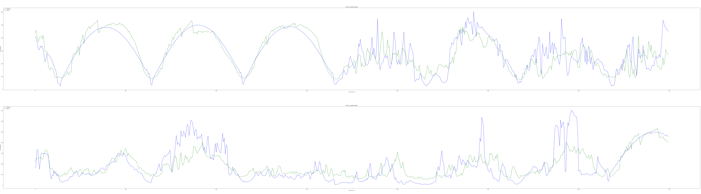

# Solar-Prediction-With-ML
## Description
Use weather and sky image data to make solar prediction with RNN, ANN, and linear model
Solar Power is a fluctuating energy. This variability can do harm to the grid with existing electricity. If we can predict the immediate power, not only can solar power plant utilize battery beforehand to balance the fluctuation of Solar power, but also the utility management system (like ​Taipower Company​) can correctly schedule spinning reserves and demand response. 
 
There are currently different time span of prediction, intra hour, intra day, and day ahead, in which the forecast skill decrease when time span decrease.Thus, our group aims to maximize the accuracy of prediction of intra hour and we select forecasting horizons of 1 min, 5 min, 15 min, 60min.  
 
In intra hour forecast, there are two dominant input mainly use in current thesis: 
1. Sky Images
2. Meteorological records: 
   1. ghi/dni solar irradiance
   2. solar elevation
   3. weather data The most popular model used is ANN and there are few literature use RNN to compare over ANN. Thus, our team design experiments to achieve two goals, one is to analyze the performance of RNN and pick Linear model and ANN as our comparison models. sky image and Meteorological input to predict solar irradiance. Then,we will do some comparison and discussion on which model performs better in terms of accuracy. 

## Environment Requirement
Please install Anaconda and create a new environment which is installed Keras, Tensorflow, Scikit-learn, Pandas, Numpy. Download the following data:
1. Irradiance.csv: https://drive.google.com/file/d/1G-AroW8qo3ivKllFv-VogjP-tdyinoM9/view?usp=sharing
2. Weather.csv: https://drive.google.com/file/d/1A-H0ogyn7rk75DQhbnx3xNx7AXXNmFRk/view?usp=sharing
3. Sky_image: https://drive.google.com/file/d/1fBbnYIIqH2Xm88PiYUM3u_aGA88fTYWO/view?usp=sharing

Then, change the global variable `dir` into the directory of the required data in the Experiement1_Weather.ipynb and Experiment2_Sky_Image.ipynb. Execute in the Anaconda environment.

## Data Source
In this research, we use the “comprehensive dataset for the accelerated development and benchmarking of solar forecasting methods” dataset provided by Hugo T. C. Pedroa, David P. Larsona, and  Carlos F. M. Coimbra. Below is the link of the possible dataset. https://zenodo.org/record/2826939#.XfM9uWQzZPZ

## Experiments
### Experiment 1
In this experiment, we take current weather data and irradiance as input to predict future irradiance. For weather input, we take in ambient temperature,relative humidity, pressure, wind speed, wind direction, maximum wind speed, and precipitation. For irradiance, we take current GHI, DNI, DHI as input to predict future irradiance in GHI.

### Experiment 2
For sky image experiment, we take in ghi, dni, clear sky irradiance, clear sky index, and sky image features. 

